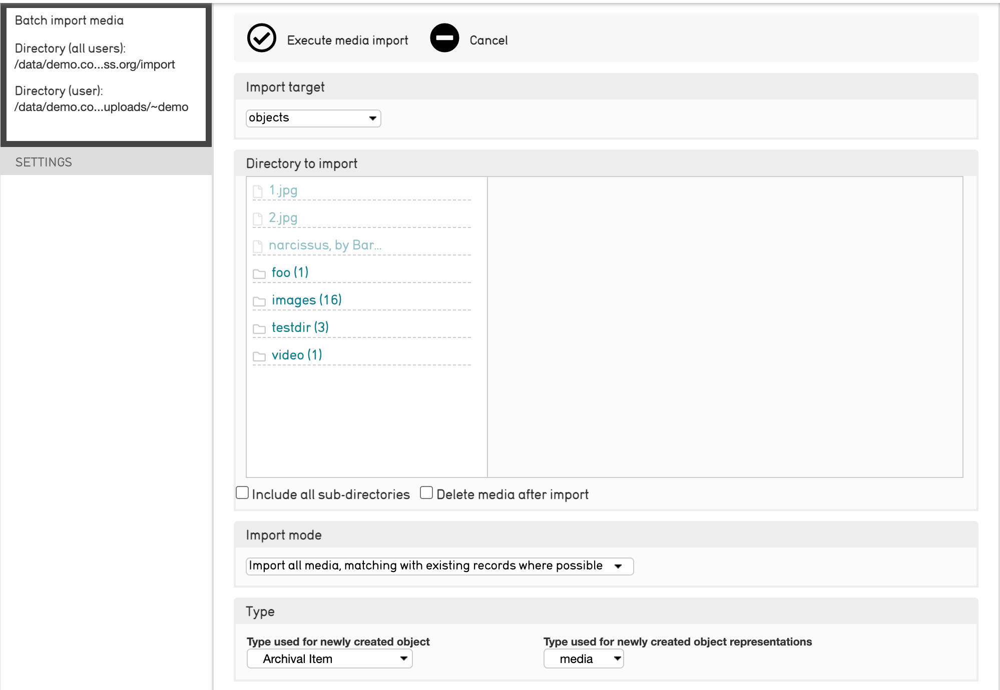

# Batch Uploading Media

## About Batch Media Import

CollectiveAccess supports the upload of entire directories of media at once, also known as batch importing. This feature is useful for uploading multiple images or other media files without uploading each file by hand.

When a directory of media is uploaded, the media importer will do the following:

* Generate new records for each file, which can be completed later by hand, or by using the Batch Editor tool

* Match each file with existing records in CollectiveAccess

* A combination of both

## Batch Importing Media

To batch import media, use the CollectiveAccess Media Importer. To access the media importer, navigate to **Import > Media.** The media importer will display:

Where a variety of options are available to configure the media import. Read on to learn about each option and its functionality.

## Batch Import Options

### Target

Media is stored in CollectiveAccess via media representation records. Each time media is imported into CollectiveAccess, a new media representation record is created. However, these records are almost always associated with other types of records from primary tables such as Objects.

Use the Import Target drop-down (shown above) to set which primary table and type of record the media representations should be associated with (Objects, Entities, Collections, and so on.)

### Directory to Import

Check the inspector to find out what server directory is associated with the importer tool. By default, it is set to your installation’s /import folder. However, the directory can be changed in app.conf.

A hierarchy browser reflecting the import directory will be displayed. The hierarchy browser contains two settings under Directory to Import:

1. Include all sub-directories: imports the field stored in the sub-directories. If not selected, only files stored in the selected directory will be imported.

2. Delete media after import: Media will be deleted from the directory after it is imported into CollectiveAccess.

### Import Mode

Import mode determines how the media will be imported into CollectiveAccess. Choose from the following options in the drop-down menu:

| Setting | Description 
|----|----|
|Import all media, matching with existing records where possible|This setting will match media with existing records in cases where the media filename matches the record’s idno. In all other cases, new records will be generated for each media file|
|Import only media that can be matched with existing records|This setting will import only the media that can be matched with an existing record by finding matches between filename and record idno. All other media files will be skipped|
|Import all media, creating new records for each|This setting will import all media in the chosen directory filepath. Brand new records will be created for ecah media file|

### Type

Select the record type the media will be related to, and set the media representation type. 

| Setting | Description 
|----|----|
|Type used for newly created object|This menu will be populated with the import target’s type list. If the target is objects, you can select the specific object type here. The same is true for all other primary tables in CollectiveAccess.|
|Type used for newly created object representations|Use this to set the media representation type. Default values are “front” and “back”|

### Set

This menu allows you to associate imported records with a set.

| Setting | Description 
|----|----|
|Add imported media to Set|This setting is followed by a drop-down menu populated by the names of existing Sets. Use this setting to add all imported media to an existing Set.|
|Create Set|This setting creates a new Set and adds all imported media records. The setting includes a field to input the title of the new Set. This option is particularly useful if you plan on editing these records later using the Batch Editor tool.|
|Do not associate imported media with a Set|Use this setting if none of the imported media should be associated with a Set.|

### Object Identifier 

Set the identifier for the media being imported. 

| Setting | Description 
|----|----|
|Set object identifier to|If creating new records, use this setting to manually set the target record’s identifier|
|Set object identifier to file name|This setting will take the media filename as the record identifier (idno). For example, my_image.jpg will be used as the identifier for the object record associated with this image|
|Set object idenfitier to file name without extension|This will create or match on filename, but with the extension. In other words, my_image.jpg simply becomes my_image. This setting is particularly useful when matching on existing records that may have identifiers that match filenames, but do not include the file extensions|
|Set object identifier to directory and file name|If this setting is used, idnos will be set using not only the filename, but also the import directory path. For example, if my_image.jpg is stored in a folder called “Media,” the record’s idno becomes /Media/my_image.jpg|

### Object Title

Set the object title.

| Setting | Description 
|----|----|
|Set object title to [BLANK]|----|
|Set object title to|----|
|Set object title to identifier|----|
|Set object title to file name|----|
|Set object title to file name without extension|----|
|Set object title to directory and file name|----|

### Status and Access

This menu simply allows you to set the status and access fields for both the import target record, as well as the representation record.

| Setting | Description 
|----|----|
|Set object status to|Set new, completed or editing in progress to the import target status. For example, “Object status” or “Entity status”|
|Set object access to|Set import target access value to accessible to public or not accessible to public|
|Set representation status to|Set new, completed, or editing in progress to the media representation’s status|
|Set representation access to|Set media representation access value to accessible to public or not accessible to public|

## Advanced Options

There are several advanced options for a batch media import. They can be found on the same Import > Media > Show advanced options.

In many cases, the default settings and basic options are sufficient for a media import. Advanced options include:

### Matching 

By default, matching occurs on filename. This setting manages matching on directory name, or directory name, then filename. Additionally, matching can be limited by type.

### Object Representation Identifier

This setting is similar to the object identifier setting, only it applies specifically to the object representation record, rather than the import target record.

### Relationships

Some projects have a very structured way of assigning file names to media. A media file name may not only include an identifier for the file itself, but may also include identifiers for authorities or events that are depicted in the file itself. For projects with Entity, for example, it’s not uncommon for a media filename to include the entity identifier in the file, if that media happens to depict the entity.

The “relationships” setting ensures that the object record associated with the imported image is in fact also related to the entity record. Select the related tables and the relationship type.

### Skip Files

Use Perl-compatible regular expressions to filter out files in the media directory that will be skipped. Skipped files may also be listed by the filenames, one per line.

### Miscellaneous

Includes three options:

* Log level: This setting controls the level of detail in the log. The log can capture errors, warnings, alerts, informational messages, and debugging messages. Select debugging messages for the most comprehensive log.

* Allow duplicate media: Duplicate media files will be skipped. Use this setting to override this.

* Replace existing media: The imported media will replace existing media in the system.

