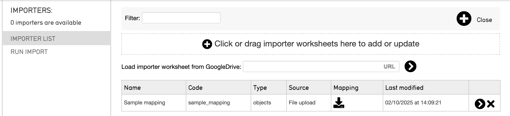

# The Importer User Interface (UI)

In progress documentation about the Importer UI

## What is the Importer UI?

There are two ways to import data into CollectiveAccess:

1. Directly from the command line (terminal). This method is recommended for larger imports, so the import is not tied up by a web browser. 
2. Through a web browser within the Providence user interface in CollectiveAccess. 

The CollectiveAccess importer UI is the interface in a web browser through which data is ingested into a CollectiveAccess system. Mapping files and source data are uploaded, and the import process can be run from the UI. 

## How does the Importer UI work? 

The importer UI contains two main sections: the Importer List page, and the Run Import page. 

The Importer UI takes import mappings that have been uploaded to the UI in the Importer List, and then processes those mappings along with source data uploaded to the UI on the Run Import page. A data import processes 1 record at a time against the import mapping. 

### Importer List

The importer UI displays two pages:

1. The Importer List
2. Run Import

The Importer List is where mappings are uploaded and saved. There is an option to load an import mapping from GoogleDrive using a link; simply place the URL into the URL text box, and select the black arrow.

The Importer list also saves the following information for each uploaded import mapping: 

* Name *this is defined in the “Settings” of an import mapping spreadsheet, and is the name of the mapping given in arbitrary text; for example “My Mapping”*

* Code *this is the alphanumeric code of the mapping, which is defined in the “Settings” of the import mapping; for example “my_mapping”*

* Type *this corresponds to the type_id, indicating the type of data, which is defined in the “Settings” of the import mapping; for example “physical object”*

* Source *how the mapping was uploaded (file upload, GoogleDrive)*

* Mapping *the mapping spreadsheet can be downloaded from here*

* Last modified *records the date and timestamp of when the mapping was last uploaded in the UI*

:::note
The Importer List will keep all import mapping spreadsheets that are uploaded unless they are removed from the list by the user.
:::

Uploading a mapping to the Importer List is the first step in the data import process. To begin an import with any uploaded mapping, selecting the black arrow to the right of each mapping will navigate to Run Import. 

### Run Import

Run Import is where the data import is performed. The data file is uploaded, and other options relating to the import appear. 

The run import page has 6 sections: 

* Importer *displays the name of the import mapping spreadsheet that was uploaded on the Import List**

* Data format *specifies the data format of the source data; this is taken from the “Input format” setting in the mapping spreadsheet. There is also an option to import all data sets* 

* Data file *specifics relating to the upload of source data files. Source data can be uploaded directly by choosing a file, from the import directory, or from a GoogleDrive link*

* Log level *specifies what errors appear in the importer UI as the import runs*

* Limit log to: * 

* Testing options: * 

A source data file must be selected in order for a data import to run. However, selecting specifics relating to the Log level, Limit Log to, and Testing options are optional. 

For more details, see [Running an Import](https://docs.collectiveaccess.org/providence/user/import/running). 

## Removing a Mapping from the Import List 

The importer list will not automatically remove previous versions of import mapping spreadsheets; each version you upload will be saved. 

To remove a mapping spreadsheet, simply select the black X on the far right of the List. 

## Making Changes to an Import Mapping in the Import List

Part of the data import process involves looking at errors, adjusting the import mapping, and re-running the data using the revised mapping. Each time you drag an import mapping onto the importer list, it will be saved.

Once you make changes to an import mapping, and re-upload it to the Importer List, it will be automatically saved to the Importer list. If the name and code of the revised mapping match the previous version exactly, the revised mapping will simply replace the previous version in the list. If the name and code of the mapping do not match, the mapping will simply be added to the List. 

