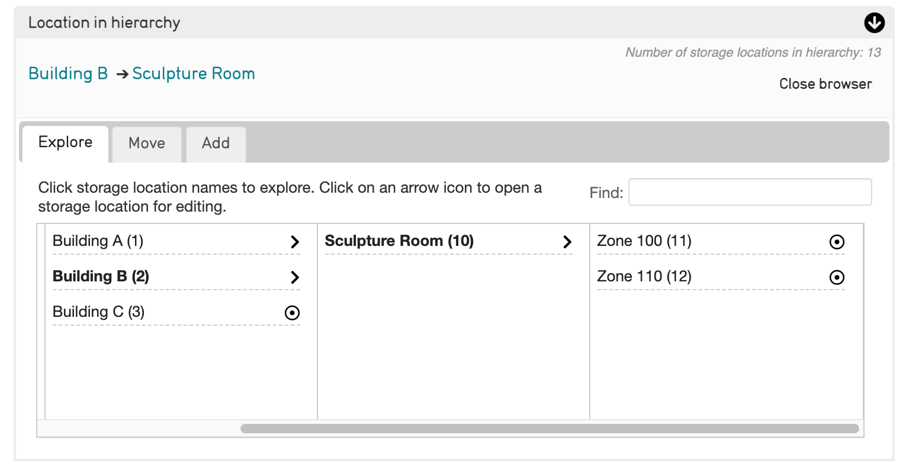
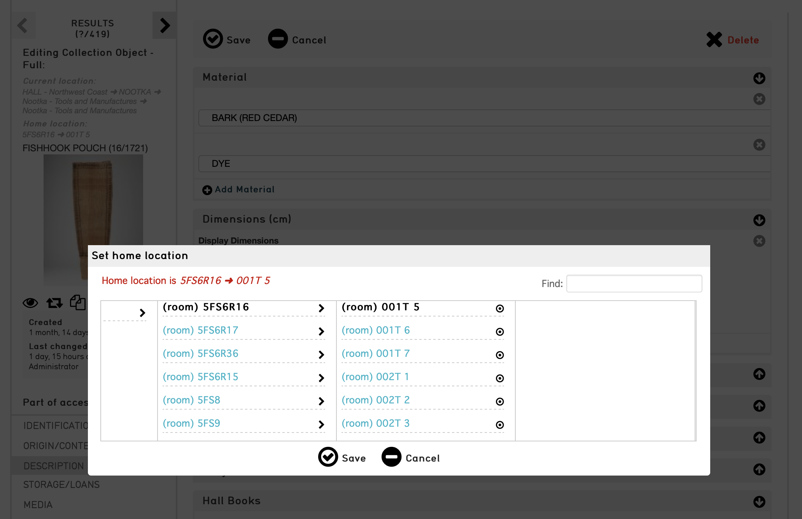

# Tracking Current Object Location

:::note
The system for location tracking was completely rebuilt for version 1.8
with a new, more general, configuration format and additional features.
Older configurations should work as before, but the configuration
options described below should be used for new setups. To maintain
compatibility with future releases consider updating your existing
configuration to use the current options.
:::

## Overview

CollectiveAccess provides a storage location hierarchy to describe the
physical locations where collection objects may be located, displayed or
stored. Storage locations are just another type of record and may be
associated with objects using relationships. The location of an object
may be recorded by creating a relationship between object and location.



This arrangement has the advantage of simplicity but comes with
significant limitations:

-   If your objects move often you\'ll soon have a long list of previous
    locations, which can make it difficult to figure out what the
    *current* location is.
-   While the current location can be distinguished using a specific
    relationship type (Eg. \"past location\" for previous locations and
    \"current location\" for the latest location), you must manage
    setting of these types yourself, which is labor intensive and prone
    to error.
-   Removing previous locations and only recording only a single,
    current location will result in a simpler and easier to manage
    display, but no location history will be maintained. For many users,
    losing location history data is not acceptable.
-   Only storage location records may be used to record location. If an
    object is on loan or exhibition workarounds must be employed, such
    as dummy \"On loan\" and \"On exhibition\" storage locations
    records.

The history value tracking system (first available in CollectiveAccess
version 1.8) provides a flexible way to track object locations over
time. It can also be used to track other time-varying information such
as provenance and current collection. The system employs tracking
*policies* to maintain chronologies based upon one or more data
elements, and can return full histories as well as current values for
any type of record. Tracking of object location is the focus in this
discussion, but the approaches described here may be applied to other
types of time-varying information.

## Tracking Approaches

To support tracking methodologies required by different types of museum
and archival collections, CollectiveAccess offers two approaches to
location tracking:

> -   **Workflow-based location tracking.** Current location is recorded
>     for an object across a range of record types representing various
>     related activities, including loans, occurrences (typically
>     representing exhibitions), collections, deaccession and storage
>     location/inventory. The types of records considered part of the
>     tracking workflow, how their dates are established for assembly
>     into a chronology, and how they are displayed within the
>     chronology are specified in a tracking *policy*. Policies are
>     configured in the `app.conf` configuration file using the
>     *history_tracking_policies* described below.
> -   **Movement-based location tracking.** Location is recorded for
>     objects in related movement records. Each movement record captures
>     details about a specific change in location for one or more
>     objects. The current location for an object is considered to be
>     the location referred to by the most recent movement by date.
>     Movement of entire storage locations within the location hierarchy
>     can be configured to generate a movement record, allowing current
>     location tracking to be based upon both individual object moves
>     and movements of containers and other storage units.
>     Movement-based tracking is more complicated to configure and use,
>     and is only called for when capture of complex metadata (packing,
>     transport, insurance, etc.) regarding chain of custody and methods
>     used to transition groups of objects between locations is
>     required. This additional documentation comes at the expense of
>     added complexity and data entry, as every movement of objects
>     requires completion of a detailed record.

Nothing prevents mixing the two approaches if desired. You may record
new locations with workflow in some cases and detailed movement records
in others. Unless you have a policy that clearly defines when
movement-based tracking is required it is suggested to use
workflow-based tracking exclusively.

:::note
Movement-based tracking is only intended for object locations. If
tracking non-location values such as provenance, use workflow-based
tracking.
:::

## Configuration

The same configuration format is used for both workflow and
movement-based tracking, with minor differences. Most configuration
occurs within the top-level `history_tracking_policies` entry in
`app.conf`. Under this entry
are two entries, both mandatory:

> -   **policies** defines all available tracking policies. Most
>     operational configuration resides under this key.
> -   **defaults** specifies which policy should be used by default for
>     a given `table`.
>     You may define multiple policies per table and declare specific
>     policies be used in various contexts such as user interface
>     bundles. Default policies are a convenience that simplify
>     configuration by declaring a standard policy to be used in most
>     cases.

### Workflow-based Location Tracking

An example `history_tracking_policies` configuration for workflow-based
location tracking is shown below: 

```
history_tracking_policies = {
	defaults = { 
		ca_objects = current_location
	},
	policies = {
		current_location = {
			name = _(Current location),
			table = ca_objects,
			contents = {
				expandHierarchically = 1,
				template = "^ca_object_representations.media.icon ^ca_objects.preferred_labels"
			},
			elements = {
				ca_storage_locations = {
					__default__ = {
						date = ca_objects_x_storage_locations.effective_date,
						setInterstitialElementsOnAdd = [effective_date],
						useDatePicker = 0,
						template = "<l>^ca_storage_locations.hierarchy.preferred_labels.name%delimiter=_➜_</l>  <ifdef code='ca_objects_x_storage_locations.movement_by'> <br>MOVED BY: ^ca_objects_x_storage_locations.movement_by</ifdef>  <ifdef code='ca_objects_x_storage_locations.movement_comments'> <br>COMMENTS: ^ca_objects_x_storage_locations.movement_comments</ifdef>",
						trackingRelationshipType = related,
						restrictToRelationshipTypes = [related]
					}
				},
				ca_occurrences = {
					exhibition = {
						date = ca_occurrences.exhibition_date,
						setInterstitialElementsOnAdd = [effective_date],
						template = "<l>^ca_occurrences.preferred_labels.name</l>",
					},
					__default__ = {
						date = ca_objects_x_occurrences.effective_date,
						setInterstitialElementsOnAdd = [effective_date],
						template = "<l>^ca_occurrences.idno</l> ^ca_occurrences.preferred_labels.name",
					}
				 },
				 ca_loans = {
					__default__  = { 
						date = ca_loans_x_objects.effective_date,
						setInterstitialElementsOnAdd = [effective_date],
						color = F78B8B,
						template = <l>^ca_loans.idno</l> ^ca_loans.preferred_labels (^ca_loans.institution ^ca_loans.date) <ifdef code='ca_loans_x_objects.movement_comments'> <br>COMMENTS: ^ca_loans_x_objects.movement_comments</ifdef>,
						restrictToRelationshipTypes = [loan]
					  }   
					}
				}
			}
		}  
     }
```

Within the `policies` section are settings for each configured policy.
In the example, a single policy with the code `current_location` is
defined. Within each policy are entries for `name` (the display name of
the policy), `table` (the tables to which this policy applies),
`contents` and `elements`.

`Contents` sets default configuration values for the current contents
bundle when displaying this policy. (See the \"The current contents
bundle\" section below for more information on use of this bundle).
These defaults may be overriden by setting option values for the
placement of the bundle in the user interface. Options include
`expandHierarchically` (show contents of child locations) and `template`
(template used for display of each item in the contents list).

`Elements` defines the various types of data used by the policy to
determine current location. Each key is a
`table` name. Within each
table block are entries for types. The special `__default__` type is
used to match any type not explicitly listed for the table. In the
example the configuration for storage locations (ca_storage_locations)
applies to all types of locations. The ca_occurrences entry includes a
configuration specifically for occurrences of type \"exhibition\", and a
default configuration for all other types.

Each per-type configuration must include entries for `date` and
`template`. `date` is a [bundle specifier](https://camanual.whirl-i-gig.com/providence/user/dataModelling/bundleSpecifiers)
for a date field in either the related table or the relationship to that
table. The value in the specified field will be used to determine where
in the chronology of tracked values each related record is placed. In
the example, the object-location relationship `effective_date` intrinsic
field is used to track locations, while the occurrence `exhibition_date`
metadata element is used to place exhibitions in time. `template` is a
`display template`used to format data for the related record for display in
the chronology. The template will be evaluated relative to the
relationship between the object and related record, allowing inclusion
of both interstitial (relationship-based) and related-record metadata.
In the example the template for loans includes data from both the
related loan record as well as the object-loan relationship.

Other, optional settings in per-type configuration configuration include
`color` (for color-coding within the chronology),
`restrictToRelationshipTypes` (a list of relationship types to limit
chronology display to), `setInterstitialElementsOnAdd` (a list of
interstitial fields to allow the user to set when creating a
relationship from within the chronology). The full list of possible
entries is:

<table>
	<thead>
		<th>Entry name</th>
		<th>Description</th>
		<th>Mandatory?</th>
	</thead>
	<tbody>
		<tr>
			<td>date</td>
			<td>A bundle specifier referring to the date
				 metadata element containing the date       
				 values used to order related entries in    
				 the chronology.</td>
			<td>Yes</td>
		</tr>
		<tr>
			<td>dateMode</td>
			<td>When set to \"dateless\" chronology will 
                                 display relevant entries in the order in   
                                 which they were added to CollectiveAccess, 
                                 with most recently added first. If omitted 
                                 or set to any value other than             
                                 \"dateless\", entries will be sorted by    
                                 their configured date values.  </td>
			<td>No</td>
		</tr>
		<tr>
			<td>template</td>
			<td>Display template used to format data for
                                 the related record in the chronology. The  
                                 template will be evaluated relative to the 
                                 relationship between the object and        
                                 related record, allowing inclusion of both 
                                 interstitial (relationship-based) and      
                                 related-record metadata.     </td>
			<td>Yes</td>
		</tr>
		<tr>
			<td>setInterstitialElementsOnAdd</td>
			<td>   A list of interstitial fields to allow the
                                 user to set when creating a relationship   
                                 from within the chronology  </td>
			<td>No</td>
		</tr>
		<tr>
			<td>trackingRelationshipType</td>
			<td>Relationship type to use by default when 
                                 creating relationships from within the     
                                 chronology.  </td>
			<td>No</td>
		</tr>
		<tr>
			<td>sortDirection</td>
			<td> Direction to order items in the     
                                 chronology. Default is \"DESC\"            
                                 (descending, or most recent first). Use    
                                 \"ASC\" to force display with most recent  
                                 last.      </td>
			<td>No</td>
		</tr>
		<tr>
			<td>useDatePicker</td>
			<td> Set to non-zero value to enable date   
                                 picker user interface on date metadata     
                                 elements. </td>
			<td>No</td>
		</tr>
		<tr>
			<td>restrictToRelationshipTypes</td>
			<td>List of relationship types to limit   
                                 display to in the chronology output.</td>
			<td>No</td>
		</tr>
		<tr>
			<td>color</td>
			<td>Color to use for color-coding in the    
                                 chronology.      </td>
			<td>No</td>
		</tr>
		<tr>
			<td>includeFromChildren</td>
			<td>If set to a non-zero value, data from  
                                 child records are included in the          
                                 chronology.     </td>
			<td>No</td>
		</tr>
		<tr>
			<td>childTemplate</td>
			<td>If includeFromChildren is set,   
                                 childTemplate is a display template used   
                                 to format data from child records.  </td>
			<td>No</td>
		</tr>
	</tbody>
</table>

Workflow-based location tracking uses direct relationships between
objects and storage locations, loans, exhibitions, etc. to derive
current disposition, with the most recent relationship considered
current. For organizations that track simple location information (Eg.
\"where is it?\") on a per-object basis this arrangement is the simplest
and most maintainable choice.

### Movement-based Location Tracking

Movement-based location tracking provides a solution for organizations
with more complex documentation requirements, or that frequently move
groups of objects. Movement-based tracking extends workflow tracking
with an intermediate [movement] record between objects and
their locations. This record enables capture of detailed documentation
of transitions for any number of objects from one location to another.

Because movements are standalone records with the full range of
configurable fields, they are able to capture rich descriptions of moves,
including packing, shipping insurance and condition documentation. For
organizations that frequently move groups of objects, or high-value or
sensitive objects with stringent documentation requirements, the
advantages of movement-based tracking may offset the increased
complexity and data entry work that it introduces.

:::note
Workflow-based tracking is suitable for the majority of users.
Movement-based tracking introduces significant complexity and additional
data entry and should only be used by organizations with existing
location tracking policies that require it.
:::

Set up of movement-based tracking extends the typical configuration
introduced above with an entry for movement records:

```
history_tracking_policies = {
	defaults = { 
		ca_objects = current_location
	},
	policies = {
		current_location = {
			name = _(Current location),
			table = ca_objects,
			elements = {
				ca_storage_locations = {
					__default__ = {
						date = ca_objects_x_storage_locations.effective_date,
						setInterstitialElementsOnAdd = [effective_date],
						useDatePicker = 0,
						template = "<l>^ca_storage_locations.hierarchy.preferred_labels.name%delimiter=_➜_</l>  <ifdef code='ca_objects_x_storage_locations.movement_by'> <br>MOVED BY: ^ca_objects_x_storage_locations.movement_by</ifdef>  <ifdef code='ca_objects_x_storage_locations.movement_comments'> <br>COMMENTS: ^ca_objects_x_storage_locations.movement_comments</ifdef>",
						trackingRelationshipType = related,
						restrictToRelationshipTypes = [related]
					}
				},
				ca_occurrences = {
					exhibition = {
						date = ca_occurrences.exhibition_date,
						setInterstitialElementsOnAdd = [effective_date],
						template = "<l>^ca_occurrences.preferred_labels.name</l>",
					},
					__default__ = {
						date = ca_objects_x_occurrences.effective_date,
						setInterstitialElementsOnAdd = [effective_date],
						template = "<l>^ca_occurrences.idno</l> ^ca_occurrences.preferred_labels.name",
					}
				},
				ca_loans = {
					__default__  = { 
						date = ca_loans_x_objects.effective_date,
						setInterstitialElementsOnAdd = [effective_date],
						color = F78B8B,
						template = <l>^ca_loans.idno</l> ^ca_loans.preferred_labels (^ca_loans.institution ^ca_loans.date) <ifdef code='ca_loans_x_objects.movement_comments'> <br>COMMENTS: ^ca_loans_x_objects.movement_comments</ifdef>,
						restrictToRelationshipTypes = [loan]
					  }   
				},
				ca_movements = {
					__default__ = {
						date = ca_movements.placementDate,
						setInterstitialElementsOnAdd = [effective_date],
						template ="<unit relativeTo='ca_movements'>[^ca_movements.idno] <l>^ca_movements.preferred_labels.name</l>,  ^ca_movements.purposeNotes<br/>
								<unit relativeTo='ca_storage_locations' restrictToRelationshipTypes='location'>Moved to <l>^ca_storage_locations.hierarchy.preferred_labels.name%delimiter=_➜_</l></unit>
							</unit>",
						trackingRelationshipType = location,

						# useRelated = for browsing purposes log the current value as the first related item in this table
						useRelated = ca_storage_locations,

						# useRelatedRelationshipType = relationship type used when logging current value against related table
						useRelatedRelationshipType = location_tracking,

						# ca_movements_x_storage_locations relationship types for old and new parent locations 
						# (used when tracking movements of storage locations within the location hierarchy)
						originalLocationTrackingRelationshipType = original_location,
						newLocationTrackingRelationshipType = new_location,
						subLocationTrackingRelationshipType = sub_location
					}
				}
			}
		}
	}
 }
```

The configuration above assumes that your system has a fully configured
movement record with fields suitable for your application. The example
also assumes that the movement record includes DateRange `placementDate`
(for placement within the chronology) and text `purposeNotes` (for
display) metadata elements. Movement records can be structured as
required, but at a minimum must include a DateRange element used to
place the movement within the chronology. Relationship types between
movements and objects and movements and storage locations must also be
added to your application and configured here. Because the user
interface uses single-screen movement \"quick-add\" forms in many
context for creation of movement records in the course of cataloguing,
be sure to include all important movement metadata elements on the
default page of the movement editing interface.

Most of the configuration for movements is similar to that used for
other related records (Eg. storage locations, loans, occurrences), and
by default behavior is similar as well. When a movement is the most
recent relationship, the \"current location\" is represented by the
*movement* record, not the location that is the destination of the
movement. All display data is generated relative to the movement
relationship, and all browsing will be on movements rather than
locations.

Since the movement record is just an intermediate descriptive link
between objects and locations, typically a mixed display of movement and
location data is desirable, with browsing performed on the target
storage locations rather than directly on movements. Display of mixed
movement and location data is possible using
`display templates`
with \<unit\> tags traversing relationships between movement and storage
location (for more on conditional tags, see [Display Template Syntax](https://camanual.whirl-i-gig.com/providence/user/reporting/display_templates)). In the example configuration, the template displays movement
identifier, label and purpose notes text, before jumping to the related
storage location record (related with relationship type = \"location\")
and displaying the full hierarchical location path. To adjust browsing
to operate using locations linked to movements rather than the movements
themselves set the `useRelated` entries to the type of record that
should be browsed. Typically this will be `ca_storage_locations`. You
can optionally limit the range of movement-related storage locations to
browse on by setting `useRelatedRelationshipType` to a valid
movement-storage location relationship type.

### Tracking Location Movement

Movement of objects may be initiated indirectly if the storage location
in which they are currently resident is moved. For example, if a cabinet
storage location is moved from one room to another, it may be desirable
to log that movement against all objects in the cabinet. The cabinet
contents have not moved relative to the cabinet, but the absolute
location of objects in the cabinet *has* changed. By default,
CollectiveAccess will simply update the current location to reflect the
new position of the storage location without any additional logging. The
only indication that the storage location itself had moved would be in
the change log for the location record.

Some organizations require that all movements of objects, direct and
indirect, be explicitly logged. CollectiveAccess supports this through
location change movement logging. These [app.conf](https://camanual.whirl-i-gig.com/providence/user/configuration/configuringProvidence/mainConfiguration/app)
configuration directives control creation of movement records when
moving locations:

<table>
	<thead>
		<th>Entry name</th>
		<th>Description</th>
		<th>Mandatory?</th>
	</thead>
	<tbody>
		<tr>
			<td>movement_storage_location_date_element</td>
			<td> The element code for the movements record 
                                                             date metadata element to use as the        
                                                             effective date for movement-location       
                                                             relationships. Required when movement      
                                                             based location tracking is used. </td>
			<td>Yes</td>
		</tr>
		<tr>
			<td>record_movement_information_when_moving_storage_location</td>
			<td> Set to a non-zero value to require a    
                                                             movement record to be completed when a     
                                                             storage location is moved within the       
                                                             location hierarchy. The form used is the   
                                                             default screen for the default movement    
                                                             editor  </td>
			<td>No</td>
		</tr>
		<tr>
			<td>original_storage_location_path_template</td>
			<td> A display template formatting the storage 
                                                             location for display. Values generated     
                                                             using this template capture the name (and  
                                                             usually the full hierarchical path) of a   
                                                             storage location at the time the           
                                                             relationship was created. These historical 
                                                             values are used to ensure display of the   
                                                             original storage location placement within 
                                                             the location hierarchy for locations       
                                                             subsequently moved within the hierarchy.   
                                                             If omitted, a default template displaying  
                                                             the full hierarchical path to the location 
                                                             is used.  </td>
			<td>No</td>
		</tr>
	</tbody>
</table>

When
`record_movement_information_when_moving_storage_location`
is set in [app.conf](https://camanual.whirl-i-gig.com/providence/user/configuration/configuringProvidence/mainConfiguration/app), a movement record will be created each
time a storage location is moved within the location hierarchy. The
movement will be linked to all objects resident in the location, and in
addition to a link to the location, the movement will also be linked to
the old and new parent locations. These relationships can be
distinguished using relationship types configured in the
`originalLocationTrackingRelationshipType` and
`newLocationTrackingRelationshipType` directives within
current location policy [ca_movements] element
configuration. If the location being moved has sub-locations these may
be optionally linked to the movement via the relationship type defined
in `subLocationTrackingRelationshipType`. Omit this setting
to skip linking sub-locations to movements.

Once a location\'s position within the hierarchy is changed, the full
hierarchical path to the location will reflect its current value
wherever it is displayed. While generally desirable, display of the
current path can be misleading in the chronology, as movements to the
location made before its change of hierarchy location will display the
current hierarchical path rather than the path at the time of the
movement. The [app.conf]
[original_storage_location_path_template] setting can be
used to format an archived path for display in these cases. The template
is evaluated relative to the location at the time of the movement and
stored in the movement-location
([ca_movements_x_storage_locations]) relationship. It can be
included in display templates using the special bundle specifier
[ca_movements_x_storage_locations.original_path]. You should
use this value to display original paths in chronologies when tracking
location movement. An example configuration with movement-based location
tracking the includes both direct and indirect movements:

```
history_tracking_policies = {
	defaults = { 
		ca_objects = current_location
	},
	policies = {
		current_location = {
			name = _(Current location),
			table = ca_objects,
			elements = {
				ca_storage_locations = {
					__default__ = {
						date = ca_objects_x_storage_locations.effective_date,
						setInterstitialElementsOnAdd = [effective_date],
						useDatePicker = 0,
						template = "<l>^ca_storage_locations.hierarchy.preferred_labels%delimiter=_➜_</l>",
						trackingRelationshipType = Current,
						restrictToRelationshipTypes = [Current],
						color = "#cccc00"
					}
				},
				ca_movements = {
					__default__ = {
						date = ca_movements.placementDate,
						setInterstitialElementsOnAdd = [effective_date],
						template ="[^ca_movements.idno] <l>^ca_movements.preferred_labels.name</l>,  ^ca_movements.purposeNotes<br/>
<unit relativeTo='ca_movements'>
		<ifcount code='ca_storage_locations.related' restrictToRelationshipTypes='location' min='1'><unit relativeTo='ca_movements_x_storage_locations' restrictToRelationshipTypes='location'>Moved to  
		<case>
			<ifdef code='ca_movements_x_storage_locations.original_path'> <l relativeTo='ca_storage_locations'>^ca_movements_x_storage_locations.original_path</l></ifdef>
			<ifdef code='ca_storage_locations.location_id'> <l relativeTo='ca_storage_locations'>^ca_storage_locations.hierarchy.preferred_labels.name%delimiter=_➜_</l></ifdef>
		</case></unit></ifcount>

		<ifcount code='ca_storage_locations.related' restrictToRelationshipTypes='new_location' min='1'> (movement of <unit relativeTo='ca_storage_locations' restrictToRelationshipTypes='location'><l>^ca_storage_locations.preferred_labels.name%delimiter=_➜_</l></unit> from <unit relativeTo='ca_storage_locations' restrictToRelationshipTypes='original_location'><l>^ca_storage_locations.hierarchy.preferred_labels.name%delimiter=_➜_</l></unit> to <unit relativeTo='ca_storage_locations' restrictToRelationshipTypes='new_location'><l>^ca_storage_locations.hierarchy.preferred_labels.name%delimiter=_➜_</l></unit>)</ifcount>

</unit>",
						trackingRelationshipType = location,

						# useRelated = for browsing purposes log the current value as the first related item in this table
						useRelated = ca_storage_locations,

						# useRelatedRelationshipType = relationship type used when logging current value against related table
						useRelatedRelationshipType = location_tracking,

						# ca_movements_x_storage_locations relationship types for old and new parent locations
						originalLocationTrackingRelationshipType = original_location,
						newLocationTrackingRelationshipType = new_location,
						subLocationTrackingRelationshipType = sub_location
					}
				 }
			}
		}
	} 
}
```

The above configuration uses all of the available movement-specific
options available:

<table>
	<thead>
		<th>Entry name</th>
		<th>Description</th>
		<th>Mandatory?</th>
	</thead>
	<tbody>
		<tr>
			<td>useRelated</td>
			<td>A valid related table name. If set the
first related item from the table will be  
logged as current value for purposes of    
browsing only. This option is typically    
used to allow browsing of objects by       
storage location when those storage        
locations are related via a movement       
record.  </td>
			<td>No</td>
		</tr>
		<tr>
			<td>useRelatedRelationshipType</td>
			<td>A valid relationship type for              
relationships between the related table    
set in the \"useRelated\" option and the   
table for which current values are being   
tracked. This relationship type will be    
used to filter related records prior to    
logging a modified current value for       
browsing purposes.  </td>
			<td>No</td>
		</tr>
		<tr>
			<td>originalLocationTrackingRelationshipType</td>
			<td>When logging movement of a location within 
the hierarchy, the relationship type to    
use to link the original (old) location to 
the movement record.</td>
			<td>No</td>
		</tr>
		<tr>
			<td>newLocationTrackingRelationshipType</td>
			<td>When logging movement of a location within 
the hierarchy, the relationship type to    
use to link the new (destination) location 
to the movement record. </td>
			<td>No</td>
		</tr>
		<tr>
			<td>subLocationTrackingRelationshipType</td>
			<td>When logging movement of a location within 
the hierarchy, the relationship type to    
use to link and sub-locations of the       
location to the movement record. </td>
			<td>No</td>
		</tr>
	</tbody>
</table>

## The Chronology Bundle

You can display a chronology of values for a policy in the editing user
interface using the `history_tracking_chronology` bundle.


The bundle is designed to provide a centralized control panel for
managing current location, and includes tools to update location with
new loans, movements, occurrences, storage locations, collections and
entities. It also offers tools to remove existing relationships and edit
interstitial (relationship-specific) data. These tools may be disabled
if desired.

Storage locations, occurrences, loans, movements, etc. related to the
object are displayed in chronological order, with the most recent first
by default. Information from each related record may be formatted using
display templates. By default all settings are taken from the policy
configuration in [app.conf], but can be overriden by values
specific to placements of the bundle in the user interface.

At a minimum when adding a chronology bundle to the editing user
interface, you must specify a policy. There are many other options which
can be set in the
[installation profile](https://camanual.whirl-i-gig.com/providence/user/dataModelling/profiles/) if desired. Available options include:

<table>
	<thead>
		<th>Entry name</th>
		<th>Description</th>
		<th>Mandatory?</th>
		<th>Default value</th>
	</thead>
	<tbody>
		<tr>
			<td>policy</td>
			<td> The code of history tracking policy to   
                                          display. </td>
			<td>Yes</td>
			<td>None</td>
		</tr>
		<tr>
			<td>displayMode</td>
			<td> Format of display. May be set to either       
                                \"chronology\" (chronological view of                   
                                          history) or \"tabs\" (tabbed display with               
                                          current value and history separated). Most              
                                          history management options are only                     
                                          available when using the chronology                     
                                          display mode.  </td>
			<td>No</td>
			<td>chronology</td>
		</tr>
		<tr>
			<td>dateMode</td>
			<td>Determines method used to order the     
                                          chronology. May be set to either                        
                                          \"use_dates\" (sort by date as configured)              
                                          or \"dateless\" (sort by order entered).                
                                          \"dateless\" is typically used as a                     
                                          fallback when legacy location data lacks                
                                          specific dates.  </td>
			<td>No</td>
			<td>use_dates</td>
		</tr>
		<tr>
			<td>useAppConfDefaults</td>
			<td>Use policy defaults as configured in     
                                          app.conf when set to a non-zero value.                  
                                          Setting to zero allows override of many                 
                                          options.</td>
			<td>No</td>
			<td>1</td>
		</tr>
		<tr>
			<td>sortDirection</td>
			<td>Direction to order items in the    
                                          chronology. Default is \"DESC\"                         
                                          (descending, or most recent first). Use                 
                                          \"ASC\" to force display with most recent               
                                          last.    </td>
			<td>No</td>
			<td>DESC</td>
		</tr>
		<tr>
			<td>currentValueColor</td>
			<td> Background color code for current value  
                                          used when displayMode is \"tabs\"       </td>
			<td>No</td>
			<td>#EEEEEE</td>
		</tr>
		<tr>
			<td>futureValueColor</td>
			<td>Background color code for future values  
                                          used when displayMode is \"tabs\" </td>
			<td>No</td>
			<td>#EEEEEE</td>
		</tr>
		<tr>
			<td>pastValueColor</td>
			<td> Background color code for historical  
                                          values used when displayMode is \"tabs\" </td>
			<td>No</td>
			<td>#EEEEEE</td>
		</tr>
		<tr>
			<td>hide_include_child_history_controls</td>
			<td>History of children of related records can 
                                          be included on demand. Set to a non-zero                
                                          value to hide the tool to control this                  
                                          feature.      </td>
			<td>No</td>
			<td>0</td>
		</tr>
		<tr>
			<td>hide_add_to_loan_controls</td>
			<td>Set to a non-zero value to hide the tool  
                                          for adding loans to the chronology.        </td>
			<td>No</td>
			<td>0</td>
		</tr>
		<tr>
			<td>hide_add_to_movement_controls</td>
			<td>et to a non-zero value to hide the tool 
                                          for adding movements to the chronology.            </td>
			<td>No</td>
			<td>0</td>
		</tr>
		<tr>
			<td>hide_update_location_controls</td>
			<td>Set to a non-zero value to hide the tool  
                                          for adding storage locations to the                     
                                          chronology.    </td>
			<td>No</td>
			<td>0</td>
		</tr>
		<tr>
			<td>hide_return_to_home_location_controls</td>
			<td>Set to a non-zero value to hide the tool 
                                          for returning an object to its home                     
                                          location      </td>
			<td>No</td>
			<td>0</td>
		</tr>
		<tr>
			<td>hide_add_to_occurrence_controls</td>
			<td>Set to a non-zero value to hide the tool 
                                          for adding occurrences to the chronology.  </td>
			<td>No</td>
			<td>0</td>
		</tr>
		<tr>
			<td>add_to_occurrence_types</td>
			<td>A list of occurrence types to offer \"add 
                                          to chronology\" options for. Values must                
                                          be valid occurrence type codes.           </td>
			<td>No</td>
			<td>0</td>
		</tr>
		<tr>
			<td>hide_add_to_collection_controls</td>
			<td>Set to a non-zero value to hide the tool  
                                          for adding collections to the chronology.      </td>
			<td>No</td>
			<td>0</td>
		</tr>
		<tr>
			<td>add_to_collection_types</td>
			<td> A list of collection types to offer \"add  
                                          to chronology\" options for. Values must                
                                          be valid collection type codes.    </td>
			<td>No</td>
			<td>0</td>
		</tr>
		<tr>
			<td>hide_add_to_entity_controls</td>
			<td>Set to a non-zero value to hide the tool  
                                          for adding entities to the chronology.      </td>
			<td>No</td>
			<td>0</td>
		</tr>
		<tr>
			<td>add_to_entity_types</td>
			<td> A list of entity types to offer \"add to 
                                          chronology\" options for. Values must be                
                                          valid entity type codes.   </td>
			<td>No</td>
			<td>0</td>
		</tr>
		<tr>
			<td>hide_add_to_object_controls</td>
			<td>Set to a non-zero value to hide the tool  
                                          for adding objects to the chronology.  </td>
			<td>No</td>
			<td>0</td>
		</tr>
		<tr>
			<td>useHierarchicalBrowser</td>
			<td>Set to a non-zero value to offer a       
                                          hierarchcy browser when selecting storage               
                                          locations. If not set a type-ahead lookup               
                                          will be used. </td>
			<td>No</td>
			<td>0</td>
		</tr>
		<tr>
			<td>hide_value_interstitial_edit</td>
			<td>Set to a non-zero value to hide tools for 
                                          editing interstitial data on relationships              
                                          displayed in the chronology.  </td>
			<td>No</td>
			<td>0</td>
		</tr>
		<tr>
			<td>hide_value_delete</td>
			<td>Set to a non-zero value to hide the tool 
                                          from deleting items from the chronology   </td>
			<td>No</td>
			<td>0</td>
		</tr>
	</tbody>
</table>

 
:::note
When using movement-based location tracking be sure to set
[hide_add_to_movement_controls] to 0, to ensure the \"add to
movement\" controls are available.
:::

## The Current Contents Bundle

The current contents bundle (`history_tracking_current_contents`) lists
all items that currently have the record the bundle is attached to as
their current value. It is typically used on storage location records to
display a list of objects currently resident in that location.

The following options are available to set in an
[installation profile](https://camanual.whirl-i-gig.com/providence/user/dataModelling/profiles/):

<table>
	<thead>
		<th>Entry name</th>
		<th>Description</th>
		<th>Mandatory?</th>
		<th>Default value</th>
	</thead>
	<tbody>
		<tr>
			<td>policy</td>
			<td>The code of history tracking policy to use for display. </td>
			<td>Yes</td>
			<td>None</td>
		</tr>
		<tr>
			<td>list_format</td>
			<td>Format of display. May be set to either   
                    \"bubbles\" (small stacked entries) or                  
                    \"list\" (a list view of items).   </td>
			<td>No</td>
			<td>bubbles</td>
		</tr>
		<tr>
			<td>colorItem</td>
			<td>Background color to use on items.</td>
			<td>No</td>
			<td>#FFFFF</td>
		</tr>
		<tr>
			<td>displayTemplate</td>
			<td> A display template to use for each item 
                    displayed.</td>
			<td>No</td>
			<td>The preferred label of  the related item</td>
		</tr>
	</tbody>
</table>

## Inspector display


The current value of a history tracking policy may be displayed in the
editor \"inspector\" (the information panel on the upper left-hand
corner of the editor interface). The policy used may be set on a
per-table and/or per-type basis using the `inspector_tracking_displays`
entry in [app.conf](https://camanual.whirl-i-gig.com/providence/user/configuration/configuringProvidence/mainConfiguration/app).

```
inspector_tracking_displays = {
	ca_objects = {
		__default__ = {
			policy = current_location,
			label = _(Current location)
		}
	}
}
```

Each entry within `inspector_tracking_displays` is a table name. Each
table in turn has a list of types (and/or the catch-all `__default__`
type that matches type not explicitly configured). Each type has two
entries: `policy` (the policy to use) and `label` (A label placed above
the current value display). In the example above the current value for
the \"current_location\" policy is displayed when editing objects of all
types.

A typical inspector with this configuration would appear as shown in the
screen image on the right.

## Display in Templates

Current value information may be included in
`display templates` using the following tags:

<table>
	<thead>
		<th>Entry name</th>
		<th>Description</th>
	</thead>
	<tbody>
		<tr>
			<td>\^\<table\>.history_tracking_current_value </td>
			<td>The current value, formatted using the template as specified in
                                                  the policy configuration. If multiple policies are defined the
                                                  default policy is used unless a policy is specified using the
                                                  policy parameters. (Ex.
                                                  ^ca_objects.history_tracking_current_value%policy=provenance)</td>
		</tr>
		<tr>
			<td>\^\<table\>.history_tracking_current_date</td>
			<td>The date of the current value. If multiple policies are defined
                                                  the default policy is used unless a policy is specified using the
                                                  policy parameters. (Ex.
                                                  \^ca_objects.history_tracking_current_date%policy=provenance)</td>
		</tr>
		<tr>
			<td>^\<table\>.history_tracking_current_contents</td>
			<td> A list of items whose current value is the subject of the display
                                                  template. For a current location policy for objects,
                                                  ^history_tracking_current_contents will display in a template
                                                  for a storage location (for example) all objects currently at
                                                  that location. (Ex.
                                                  ^ca_storage_locations.history_tracking_current_contents)Object
                                                  preferred labels are returned. The template is not configurable.</td>
		</tr>
	</tbody>
</table>
 
By default the current value will be displayed using the `template` set
for the relevant policy element. Additional named templates may be
defined for policy elements using the optional `additionalTemplates`
entry. Each key/value pair within `additionalTemplates` defines a name
and a template. For example:

```
history_tracking_policies = {
	defaults = { 
		ca_objects = current_location
	},
	policies = {
		current_location = {
			name = _(Current location),
			table = ca_objects,
			elements = {
				ca_storage_locations = {
					__default__ = {
						date = ca_objects_x_storage_locations.effective_date,
						setInterstitialElementsOnAdd = [effective_date],
						useDatePicker = 0,
						template = "<p><l>^ca_storage_locations.hierarchy.preferred_labels%delimiter=_➜_</l><br/>^ca_storage_locations.location_notes</p>",
						trackingRelationshipType = Current,
						restrictToRelationshipTypes = [Current],
						color = "#cccc00",

						additionalTemplates = {
							simplePath = ^ca_storage_locations.hierarchy.preferred_labels%delimiter=_➜_,
							nameOnly = ^ca_storage_locations.preferred_labels
						}
					}
				},
			}
		}
	} 
}
```

Additional templates may be used in place of the policy element\'s
default `template` by passing the `useTemplate` option set to the name
of the additional template to use. For example,

    ^ca_objects.history_tracking_current_value%useTemplate=simplePath

will display the current location value using the \"simplePath\"
template, rather than the more complex default template.

:::note
If the additional template name referenced by the `useTemplate` option
is not defined for the current value\'s policy element the element\'s
default `template` will be used.
:::

:::tip
When using `additionalTemplates` with policies that include more than
one element, it is advisable to define the same set of named templates for each element.
This will ensure that a value will be displayed regardless of the type
of current value.
:::

## Searching on Current Values

Current values can be indexed for search on a per-table, per-policy
basis. Any value in the related table can be indexed, enabling search,
for example, on the description of current loans only for objects.
Typically only basic values such as name and identifier are indexed as
current values, allowing for searches on storage location names, loan
recipients, etc.

To set up current value indexing additional directives must be inserted
into the `search_indexing.conf` file. For each related table block to be indexed a new
`current_values` entry is added. Within this entry entries for each
policy are added. Within the policy entry field indexing entries in the
same format as used for regular indexing are added.

The example below is a fragment from the `ca_objects` indexing
configuration. Note the added `current_values` blocks.
`current_location` refers to a policy configured in
[app.conf].

```
# ------------------------------------
ca_storage_locations = {
    tables = {
        places = [ca_objects_x_storage_locations],
    },
    fields = {
        location_id = { DONT_INCLUDE_IN_SEARCH_FORM },
        idno = { STORE, DONT_TOKENIZE, INDEX_AS_IDNO, BOOST = 100 }
    },
    current_values = {
        current_location = {
            idno = { STORE, DONT_TOKENIZE, INDEX_AS_IDNO, BOOST = 100 }
        }
    }
},
# ------------------------------------
ca_storage_location_labels = {
    tables = {
        places = [ca_objects_x_storage_locations, ca_storage_locations]
    },
    fields = {
        location_id = { DONT_INCLUDE_IN_SEARCH_FORM },
        name = { INDEX_ANCESTORS, INDEX_ANCESTORS_START_AT_LEVEL = 0, INDEX_ANCESTORS_MAX_NUMBER_OF_LEVELS = 10, INDEX_ANCESTORS_AS_PATH_WITH_DELIMITER = .}
    },
    current_values = {
        current_location = {
            name = { }
        }
    }
},
# ------------------------------------
```

In this example both the \"idno\" field (part of ca_storage_locations)
and the \"name\" field in storage location preferred labels (the
ca_storage_location_labels table) are indexed for objects as current
values.

To search on current values use the built-in \"current_values\" access
point. Eg. to find all records with current value \"Cellar\" in any
field search on `` `current_values:Cellar ``[. To limit the search to a
specific policy use the access point \"current_values.\<policy code\>\".
Eg. ]`current_values.current_location:Cellar`\`. To search
on a specific policy and field use
\"current_values.\<policy_code\>.\<field code\>\". The field code used
must be indexed for the search to return results.

These same access point formats may be used when configuring advanced
search forms.

## Browsing on Current Values

To browse on current location add a facet to
`browse.conf` of type
\"current_value\":

```
current_location = {
        type = current_value,
        restrict_to_types = [],
        policy = current_location,

        display = {
            ca_storage_locations = {
                __default__ = { template = ^ca_storage_locations.hierarchy.preferred_labels.name%delimiter=_&gt;_ }
            }
        },

        include_none_option = No location specified,

        label_singular = _("current location"),
        label_plural = _("current locations")
    },
```

Current value-specific settings include `policy`, which must be set to a
valid policy and `display`, which customizes display of current values
within the browse. If `display` is not defined formatting defaults from
the policy are used.

The `collapse` facet option controls how current values are collapsed
into general headings rather than displayed individually. Keys of the
entry are table names and type separated with a slash ("/"). Values are
text with which to represent the collapsed group in the browse facet.
For example, to collapse all occurrences of type "exhibition" into a
single facet value labeled "On exhibition" use:

```
collapse = {
    ca_occurrences/exhibition = On exhibition
} 
```

Selecting "On exhibition" would return all objects where the current
location is any exhibition. Without the collapse setting, each
exhibition would be listed individually.

## Home Locations

From version 1.8 of CollectiveAccess it is possible to set a typical (or
\"home\") location for an object. Both the chronology
(`history_tracking_chronology`) and contents
(`history_tracking_current_contents`) bundles can include options to
return objects to their home locations, noting the change in the
chronology.

Home location can be set by clicking the small house icon in the object
editor inspector panel. A hierarchy browser will appear from which you
can select the home location.



To display the home location for an object in the inspector panel set
the `inspector_home_location_display_template` entry in app.conf to show
the desired storage location fields and formatting. The
`home_location_display_template` entry defines a template for formatting
the home location in display templates and in the hierarchy browser.

A typical configuration for these entries, displaying the selected home
location prefixed by its parent location is:

```
inspector_home_location_display_template = "<unit relativeTo='ca_storage_locations.hierarchy' delimiter=' ➜ '>^ca_storage_locations.preferred_labels.name</unit>"
home_location_display_template = <l><inspector_home_location_display_template></l>
```

The `inspector_home_location_display_template` sets the format in the
above example. The `home_location_display_template` takes that format
and surrounds it with \<l\> tags to make it a clickable link.

Home locations can be output in display templates for objects using the
tag `` `^ca_objects.home_location_value ``[. The value returned by this
tag will be formatted according to the template format in the app.conf
][home_location_display_template]\` entry.

## Updating the Cache

For performance reasons, the current locations of objects are cached in
the database and used when browsing. Since current location values are
calculated based upon the settings in [app.conf] change in
configuration will usually invalidate the cached data. To regenerate the
cache and ensure accurate browse results be sure to run the following
`caUtils` command on the
command line:

`caUtils reload-current-values-for-history-tracking-policies`

If your current value browse is returning unexpected results it is
recommended to run the command, which will often resolve the issue.


